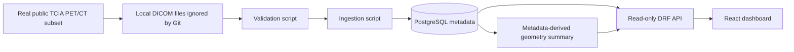

# Quantitative Molecular Imaging Platform

Quantitative Molecular Imaging Platform is a v0.1 research software portfolio
project for metadata-driven PET/CT imaging workflows. It validates a small
selected public deidentified TCIA subset locally, ingests DICOM header metadata
into PostgreSQL, computes a minimal metadata-derived geometry summary, exposes
read-only Django REST Framework APIs, and displays the results in a small
React dashboard with registered visualization artifacts.

This repository is not clinical software. It must not be used for diagnosis,
treatment decisions, or production patient care.

## What This Demonstrates

- Medical imaging data handling with explicit safety boundaries.
- Metadata-only DICOM validation and ingestion using local files.
- Django domain modeling for studies, series, instances, ingestion jobs,
  analysis runs, and measurement results.
- Read-only REST API design for research metadata.
- A minimal full-stack workflow from local data validation to PostgreSQL,
  analysis metadata, API responses, and dashboard display.
- Testable command-line tooling for reviewer-friendly local demos.

## Architecture Overview



Core components:

- Django and Django REST Framework provide the backend API.
- PostgreSQL stores imaging metadata, ingestion metadata, and analysis results.
- Utility scripts validate local DICOM checksums and headers, ingest metadata,
  and run the metadata-only geometry summary.
- Vite, React, and TypeScript provide a small dashboard for API metadata.
- Redis and Orthanc are available in the local service stack, but the v0.1 API
  and dashboard read PostgreSQL metadata only.

See [docs/architecture.md](docs/architecture.md) for a longer system overview.

## Implemented v0.1 Features

- Candidate public dataset documentation for `CT-vs-PET-Ventilation-Imaging`.
- Optional local download script for the selected CT and PT series only.
- Local checksum and DICOM header validation for the selected subset.
- Idempotent metadata ingestion for `ImagingStudy`, `ImagingSeries`, and
  `ImagingInstance`.
- Ingestion job and event metadata tracking.
- Metadata-derived series geometry summary stored as analysis metadata.
- Read-only APIs for overview, imaging metadata, ingestion metadata, analysis
  runs, measurement results, and registered visualization artifacts.
- Minimal frontend dashboard for overview counts, imaging series, and analysis
  results, with a read-only visualization artifact workbench.
- One-command local backend demo pipeline after the optional DICOM subset is
  already present locally.

## Technology Stack

- Python 3.12
- Django 5.2 and Django REST Framework
- PostgreSQL
- pytest, ruff, mypy, django-stubs
- pydicom for DICOM header reading with `stop_before_pixels=True`
- Vite, React, TypeScript, and plain CSS
- Docker Compose for local PostgreSQL, Redis, and Orthanc services

## Dataset And Safety Notes

The selected v0.1 candidate dataset is the public deidentified TCIA collection
`CT-vs-PET-Ventilation-Imaging`. The local validation subset is intentionally
small: one subject, one study, and selected CT and PT series.

Safety boundaries:

- Raw DICOM files are local-only under `datasets/raw/` and are ignored by Git.
- The repository does not store patient records, synthetic DICOM files, or fake
  medical metadata.
- The API and dashboard are metadata-only.
- Pixel data is not exposed through the API or frontend.
- Local ingestion reads DICOM headers only with `pydicom stop_before_pixels=True`.
- The geometry summary is metadata-derived from rows, columns, spacing, counts,
  and related stored metadata. It is not image analysis.
- CI and normal tests do not require local raw DICOM files.

## Quick Start

Install backend dependencies:

```sh
python -m pip install -e "backend[dev]"
```

Start local services:

```sh
make services-up
```

Apply migrations:

```sh
cd backend
POSTGRES_PASSWORD=qmip_dev_password python manage.py migrate --settings=config.settings.development
cd ..
```

Run the backend API:

```sh
cd backend
POSTGRES_PASSWORD=qmip_dev_password python manage.py runserver --settings=config.settings.development
```

Useful local URLs:

- Backend API: `http://localhost:8000/api/v1/`
- Frontend dashboard: `http://localhost:5173/`
- Orthanc local UI: `http://localhost:8042`
- PostgreSQL: `localhost:5432`
- Redis: `localhost:6379`

## One-Command Local Backend Demo

After the selected DICOM subset has already been downloaded locally, run:

```sh
POSTGRES_PASSWORD=qmip_dev_password python scripts/run_local_demo_pipeline.py
```

The pipeline validates local checksums and DICOM headers, ingests metadata into
PostgreSQL, runs the metadata-only geometry summary, and prints final database
counts. It does not download data, call external medical data services, read
pixel arrays, or perform image analysis.

The optional selected subset is created with:

```sh
python scripts/download_tcia_selected_series.py
```

That command downloads only the selected CT and PT series and stores raw DICOM
files under `datasets/raw/`, which is ignored by Git.

## Backend API Endpoints

Read-only metadata endpoints:

- `GET /api/v1/overview/`
- `GET /api/v1/imaging/studies/`
- `GET /api/v1/imaging/series/`
- `GET /api/v1/imaging/instances/`
- `GET /api/v1/ingestion/jobs/`
- `GET /api/v1/ingestion/events/`
- `GET /api/v1/analysis/runs/`
- `GET /api/v1/analysis/results/`
- `GET /api/v1/analysis/artifacts/`
- `GET /api/v1/analysis/artifacts/{id}/image/`

The API does not provide create, update, delete, upload, SQL explorer, or
query-builder endpoints. See [docs/api_usage.md](docs/api_usage.md) for curl
examples and supported query parameters.

## Frontend Dashboard

Start the backend API first, then in another shell:

```sh
cd frontend
npm install
npm run dev
```

The dashboard uses `VITE_API_BASE_URL` when set and defaults to
`http://localhost:8000`. It displays:

- Overview counts for studies, series, and instances.
- Modalities and latest ingestion status.
- Imaging series metadata.
- Stored quantitative analysis result metadata.
- Registered visualization artifacts with read-only filters and PNG image URLs.
- A safety note that no DICOM pixels are loaded and no diagnosis is performed.

The frontend does not expose local paths and does not run scientific-operation
execution; it displays only artifacts that have already been registered.

## Quality Checks

Run backend tests from the repository root:

```sh
POSTGRES_PASSWORD=qmip_dev_password pytest
```

Run backend checks from `backend/`:

```sh
python manage.py check --settings=config.settings.development
python manage.py check --settings=config.settings.test
ruff check .
mypy .
```

Run frontend checks from `frontend/`:

```sh
npm run build
npm run typecheck
npm test
```

## Repository Structure

```text
backend/
  apps/
    analysis/      Analysis run and measurement result models, services, API
    imaging/       Study, series, instance metadata models and API
    ingestion/     Ingestion job and event metadata models and API
  config/          Django settings, URLs, and local CORS middleware
  tests/           Unit, integration, and real-data manifest documentation
docs/              Architecture, dataset, API, and local workflow docs
frontend/          Vite React TypeScript metadata dashboard
scripts/           Local metadata query, validation, ingestion, and demo tools
datasets/          Local-only ignored raw and derived data directories
```

## Screenshots

Binary screenshots are not committed yet. Suggested screenshots for a future
portfolio write-up:

- Backend overview JSON from `/api/v1/overview/`.
- Frontend dashboard showing overview cards and tables.
- Terminal output from `scripts/run_local_demo_pipeline.py`.

## Current Limitations

- This is a v0.1 research and portfolio project, not a clinical system.
- No authentication or authorization is implemented.
- No upload workflow is implemented.
- No pagination is implemented.
- No SQL explorer or query-builder UI is included.
- No pixel data is exposed or visualized.
- The geometry summary is intentionally minimal and metadata-derived.
- Optional raw DICOM data must be downloaded locally by the reviewer if they
  want to run the full local-data pipeline.

## Future Roadmap

- Add optional authenticated deployment configuration.
- Add pagination and richer filtering for larger metadata collections.
- Add CI-safe metadata fixtures that do not require raw DICOM files.
- Add more quantitative metadata summaries and validation reports.
- Add dashboard refinements such as detail views and chart summaries.
- Add screenshot assets and a short portfolio case-study page.
