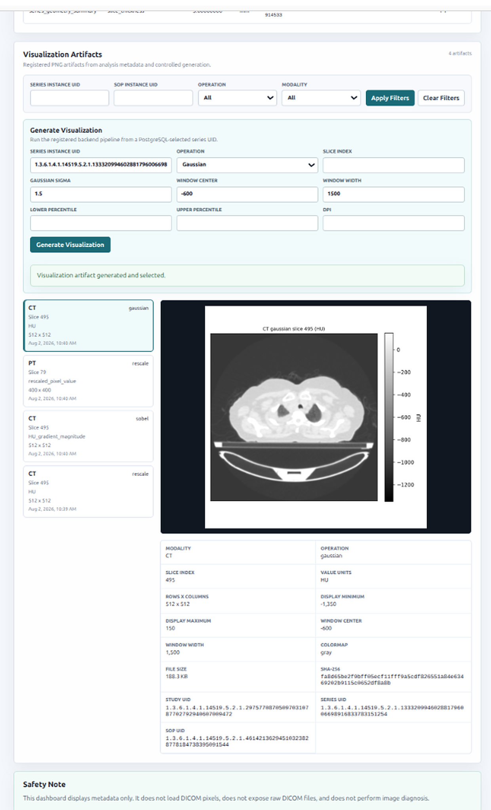
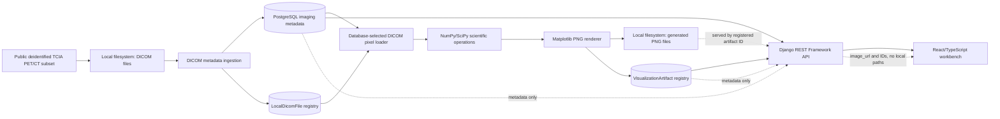

# Quantitative Molecular Imaging Platform

Quantitative Molecular Imaging Platform is a local research and portfolio
application for a selected public deidentified TCIA PET/CT dataset. It
demonstrates an end-to-end workflow from DICOM metadata ingestion to PostgreSQL
metadata and file registration, database-selected DICOM pixel loading,
NumPy/SciPy processing, Matplotlib PNG generation, `VisualizationArtifact`
registration, Django REST Framework APIs, and a React/TypeScript scientific
workbench. It is not clinical software and must not be used for diagnosis,
treatment decisions, or production patient care.

## Portfolio Screenshot



## Key Capabilities

- Local validation and ingestion for a small selected public deidentified TCIA
  PET/CT subset.
- PostgreSQL domain models for studies, series, instances, local DICOM file
  registry records, ingestion events, analysis runs, measurement results, and
  visualization artifacts.
- Database-selected local pixel loading through `LocalDicomFile`, with no
  browser-supplied filesystem paths.
- Private NumPy/SciPy operations for rescale, Gaussian filtering, and Sobel
  gradient magnitude on one selected two-dimensional DICOM slice.
- Matplotlib PNG rendering with artifact metadata registered in PostgreSQL.
- Django REST Framework endpoints for metadata, controlled visualization
  generation, artifact metadata, and registered PNG delivery by artifact ID.
- React/TypeScript workbench for filters, generation controls, PNG display, and
  scientific metadata review.

## Architecture Overview



PostgreSQL stores metadata, not PNG bytes or NumPy arrays. DICOM files and
generated PNG files remain on the local filesystem. Public API responses do not
expose filesystem paths; the browser works with registered IDs and `image_url`
values. See [docs/architecture.md](docs/architecture.md) for more detail.

## Scientific Operations

### Rescale

- Applies DICOM rescale slope and intercept.
- CT output units are Hounsfield Units (`HU`).
- PT output units are `rescaled_pixel_value`.
- PT values are not presented, inferred, or labelled as SUV.

### Gaussian Filtering

- Runs Gaussian smoothing through the existing SciPy pipeline.
- Accepts a configurable positive sigma.
- CT display can use explicit window center and width.

### Sobel Gradient Magnitude

- Computes gradient-magnitude output from the rescaled slice.
- Uses percentile-based display scaling where applicable.

Generated PNG metadata is registered in PostgreSQL as `VisualizationArtifact`
records. PNG bytes remain in local PNG files, and NumPy arrays are not stored in
PostgreSQL. CT window center and width control CT display scaling; percentile
controls affect supported display scaling for artifact rendering.

## Technology Stack

Backend:

- Python
- Django
- Django REST Framework
- PostgreSQL

Scientific imaging:

- pydicom
- SimpleITK
- NumPy
- SciPy
- Matplotlib

Frontend:

- React
- TypeScript
- Vite

Quality:

- pytest
- mypy
- Ruff
- Vitest
- React Testing Library

## Quick Start

Install backend dependencies:

```sh
python -m pip install -e "backend[dev]"
```

Start local services:

```sh
make services-up
```

Apply migrations:

```sh
cd backend
POSTGRES_PASSWORD=qmip_dev_password python manage.py migrate --settings=config.settings.development
cd ..
```

Run the backend API:

```sh
cd backend
POSTGRES_PASSWORD=qmip_dev_password python manage.py runserver --settings=config.settings.development
```

Start the frontend in a second shell:

```sh
cd frontend
npm install
npm run dev
```

Useful local URLs:

- Backend API: `http://localhost:8000/api/v1/`
- Frontend workbench: `http://localhost:5173/`
- Orthanc local UI: `http://localhost:8042`
- PostgreSQL: `localhost:5432`
- Redis: `localhost:6379`

## Demo Workflow

For a focused portfolio walkthrough, use [docs/demo.md](docs/demo.md). The demo
starts Django and Vite, opens the workbench, generates a CT Gaussian artifact,
generates a PT rescale artifact, and verifies registered PNG metadata. It
assumes PostgreSQL is running and the selected public deidentified TCIA subset
has already been ingested with available `LocalDicomFile` records.

The optional selected subset is downloaded with:

```sh
python scripts/download_tcia_selected_series.py
```

After the selected DICOM subset exists locally, the backend demo pipeline can
validate local checksums and headers, ingest metadata, run the metadata-only
geometry summary, and print database counts:

```sh
POSTGRES_PASSWORD=qmip_dev_password python scripts/run_local_demo_pipeline.py
```

## API Overview

Read-only metadata endpoints:

- `GET /api/v1/overview/`
- `GET /api/v1/imaging/studies/`
- `GET /api/v1/imaging/series/`
- `GET /api/v1/imaging/instances/`
- `GET /api/v1/ingestion/jobs/`
- `GET /api/v1/ingestion/events/`
- `GET /api/v1/analysis/runs/`
- `GET /api/v1/analysis/results/`
- `GET /api/v1/analysis/artifacts/`
- `GET /api/v1/analysis/artifacts/{id}/image/`

Controlled artifact generation:

- `POST /api/v1/analysis/artifacts/generate/`

The generation endpoint accepts `series_instance_uid`, `operation`, optional
`slice_index`, `gaussian_sigma`, `window_center`, `window_width`,
`lower_percentile`, `upper_percentile`, and `dpi`. PostgreSQL controls series
selection; clients do not submit DICOM paths, output paths, image bytes, or
arrays. See [docs/api_usage.md](docs/api_usage.md) for examples and supported
filters.

## Testing And Quality

Run backend tests from the repository root:

```sh
POSTGRES_PASSWORD=qmip_dev_password pytest
```

Run backend checks from `backend/`:

```sh
python manage.py check --settings=config.settings.development
python manage.py check --settings=config.settings.test
ruff check .
mypy .
```

Run frontend checks from `frontend/`:

```sh
npm run build
npm run typecheck
npm test
```

## Safety And Privacy Boundaries

- The selected dataset is public and deidentified, and raw DICOM files remain
  local-only under ignored data directories.
- Ingestion reads DICOM headers with `pydicom stop_before_pixels=True`.
- Local DICOM and visualization paths are stored as repository-relative
  registry metadata and are not exposed through public API responses.
- Pixel arrays are loaded only by the private database-selected processing
  layer.
- Public APIs do not expose DICOM files, NumPy arrays, SQL explorers,
  query-builder access, upload workflows, or local filesystem browsing.
- PNG files are served through registered artifact IDs and `image_url` values.
- This project has no authentication or authorization layer and is not
  production-ready.

## Current Limitations

- Portfolio and research software only; not a clinical system.
- No clinical validation, diagnostic accuracy claims, or treatment-decision
  support.
- No authentication, authorization, upload workflow, or cloud deployment
  configuration.
- No browser-side DICOM reader or machine-learning inference.
- The selected real-data workflow depends on local DICOM files and PostgreSQL
  records that are intentionally not committed to Git.
- The metadata-derived geometry summary and scientific visualizations are
  intentionally narrow demonstrations.

## Documentation Links

- [Changelog](CHANGELOG.md)
- [v0.2.0 release notes](docs/releases/v0.2.0.md)
- [Demo guide](docs/demo.md)
- [Architecture](docs/architecture.md)
- [Local workflow](docs/local_workflow.md)
- [API usage](docs/api_usage.md)
- [Dataset notes](docs/datasets.md)
- [Real-data test policy](docs/datasets/real-data-test-policy.md)
