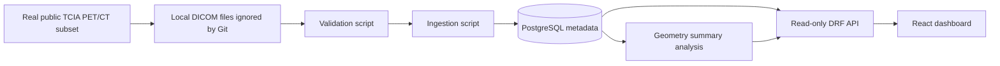

# Architecture

Quantitative Molecular Imaging Platform v0.1 is a metadata-only research
software workflow for a small selected public deidentified PET/CT subset. The
system is designed to show safe medical imaging data handling, PostgreSQL-backed
metadata modeling, read-only APIs, and a small reviewer-friendly dashboard.

## System Overview

The raw selected DICOM subset is optional and local-only. It is stored under
`datasets/raw/`, which is ignored by Git. The durable project artifacts are the
manifest documentation, metadata validation scripts, ingestion scripts, Django
models, API endpoints, and frontend dashboard.

## Backend Components

- `apps.imaging` stores study, series, and instance metadata.
- `apps.imaging.LocalDicomFile` maps one ingested `ImagingInstance` to one
  repository-relative local DICOM file.
- `apps.ingestion` stores ingestion job and event metadata.
- `apps.analysis` stores analysis runs and measurement results.
- `config.urls` exposes read-only API routes under `/api/v1/`.
- `config.cors` allows only configured development frontend origins to read the
  API during local dashboard development.

The backend API reads PostgreSQL metadata only. It does not read raw DICOM
files, does not expose DICOM pixel data, and does not perform image diagnosis.
Local DICOM registry paths are not exposed through the public metadata API.

## Data Flow

1. A selected public TCIA PET/CT subset can be downloaded locally for optional
   validation.
2. `scripts/validate_local_dicom_subset.py` verifies checksums and DICOM
   headers without reading pixel arrays.
3. `scripts/ingest_local_dicom_metadata.py` reads DICOM headers with
   `pydicom stop_before_pixels=True`, upserts imaging metadata, and creates
   `LocalDicomFile` records for repository-relative local file access.
4. `scripts/run_series_geometry_summary.py` reads PostgreSQL metadata and
   creates a minimal geometry summary as analysis metadata.
5. Read-only DRF endpoints expose overview, imaging, ingestion, and analysis
   metadata.
6. The React dashboard fetches the API responses and displays a compact
   metadata summary.

## Frontend Role

The frontend is intentionally small. It proves that the backend APIs are usable
from a browser-based dashboard and displays:

- Overview counts.
- Modalities and latest ingestion status.
- Imaging series metadata.
- Stored quantitative measurement metadata.

It does not load raw DICOM files, does not display pixel data, does not upload
files, and does not run analysis in the browser.

## Safety Boundaries

- Raw DICOM files are ignored by Git and remain local-only.
- Local DICOM registry records store repository-relative paths only. Absolute
  paths are rejected.
- Local file paths are not exposed through the public metadata API.
- No fake patient records or synthetic DICOM files are created.
- No pixel arrays are read by ingestion or validation scripts.
- The API and frontend expose metadata only.
- The geometry summary is derived from already ingested metadata.
- The project is not intended for diagnosis, treatment decisions, or production
  patient care.

## Intentionally Out Of Scope For v0.1

- Clinical deployment readiness.
- Authentication and authorization.
- Upload workflows.
- SQL explorer or query-builder UI.
- DICOM pixel visualization.
- Image analysis algorithms.
- Large dataset processing.
- CI workflows that require local raw DICOM data.

## Future Scientific Operations

The `LocalDicomFile` registry is the bridge for later scientific operations:
PostgreSQL can select specific real DICOM instances, then optional local-only
workers can resolve the repository-relative paths, load pixel data explicitly,
and run NumPy/SciPy operations. That pixel-loading workflow is intentionally not
implemented in v0.1.
