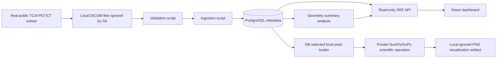

# Architecture

Quantitative Molecular Imaging Platform v0.1 is a research software workflow
for a small selected public deidentified PET/CT subset. The system is designed
to show safe medical imaging data handling, PostgreSQL-backed metadata modeling,
read-only APIs, and a small reviewer-friendly dashboard.

## System Overview

The raw selected DICOM subset is optional and local-only. It is stored under
`datasets/raw/`, which is ignored by Git. The durable project artifacts are the
manifest documentation, metadata validation scripts, ingestion scripts, Django
models, API endpoints, and frontend dashboard.

## Backend Components

- `apps.imaging` stores study, series, and instance metadata.
- `apps.imaging.LocalDicomFile` maps one ingested `ImagingInstance` to one
  repository-relative local DICOM file.
- `apps.ingestion` stores ingestion job and event metadata.
- `apps.analysis` stores analysis runs and measurement results.
- `apps.analysis.imaging_io` selects local DICOM instances through PostgreSQL,
  resolves `LocalDicomFile` records, and explicitly loads `pixel_array` for
  local scientific processing.
- `apps.analysis.scientific_operations` privately rescales DB-selected DICOM
  pixels with `RescaleSlope` and `RescaleIntercept`, then can run
  `scipy.ndimage.gaussian_filter` or `scipy.ndimage.sobel` on the local NumPy
  array.
- `apps.analysis.visualization` renders an existing private scientific result
  as a local PNG under `outputs/visualizations/`, which is ignored by Git.
  CT intensity images require an explicit window center and width; CT Sobel and
  PT images use percentile display scaling. PT values are not SUV.
- `apps.analysis.VisualizationArtifact` registers generated PNG artifact
  metadata in PostgreSQL and links each artifact to its `ImagingInstance`.
- `config.urls` exposes read-only API routes under `/api/v1/`.
- `config.cors` allows only configured development frontend origins to read the
  API during local dashboard development.

The backend API reads PostgreSQL metadata only. It does not read raw DICOM
files, does not expose DICOM pixel data, and does not perform image diagnosis.
Local DICOM registry paths are not exposed through the public metadata API.
The pixel-loading service is a private local processing layer, not a public
raw-DICOM or pixel API.

## Data Flow

1. A selected public TCIA PET/CT subset can be downloaded locally for optional
   validation.
2. `scripts/validate_local_dicom_subset.py` verifies checksums and DICOM
   headers without reading pixel arrays.
3. `scripts/ingest_local_dicom_metadata.py` reads DICOM headers with
   `pydicom stop_before_pixels=True`, upserts imaging metadata, and creates
   `LocalDicomFile` records for repository-relative local file access.
4. `scripts/run_series_geometry_summary.py` reads PostgreSQL metadata and
   creates a minimal geometry summary as analysis metadata.
5. `scripts/load_dicom_pixels_from_db.py` selects an `ImagingSeries` and
   `ImagingInstance` through PostgreSQL, resolves the linked `LocalDicomFile`,
   and explicitly reads `pydicom` `pixel_array` into a NumPy array.
6. `scripts/run_dicom_scientific_operation.py` can run a private local
   scientific operation on the DB-selected DICOM pixels. It applies
   `RescaleSlope` and `RescaleIntercept` first. CT rescaled values are reported
   as Hounsfield Units (`HU`); PT values are reported only as
   `rescaled_pixel_value`, not SUV. Gaussian filtering uses
   `scipy.ndimage.gaussian_filter`. Sobel uses `scipy.ndimage.sobel` on both
   axes and reports gradient magnitude units rather than original intensity
   units.
7. `scripts/generate_dicom_visualization.py` can render the private scientific
   result as a local PNG artifact. CT rescale and Gaussian visualizations
   require explicit window center and width. CT Sobel and PT visualizations use
   percentile display scaling. Generated artifact metadata is registered in
   PostgreSQL.
8. Read-only DRF endpoints expose overview, imaging, ingestion, and analysis
   metadata, including registered visualization artifact metadata. PNG files are
   served through artifact database IDs, not through local paths.
9. The React dashboard fetches the API responses and displays a compact
   metadata summary plus a read-only visualization artifact workbench.

## Frontend Role

The frontend is intentionally small. It proves that the backend APIs are usable
from a browser-based dashboard and displays:

- Overview counts.
- Modalities and latest ingestion status.
- Imaging series metadata.
- Stored quantitative measurement metadata.
- Registered visualization artifact metadata with read-only filters.
- Registered PNG images requested through artifact `image_url` values.

It does not load raw DICOM files, does not expose local paths, does not upload
files, and does not run analysis or artifact generation in the browser.

## Safety Boundaries

- Raw DICOM files are ignored by Git and remain local-only.
- Local DICOM registry records store repository-relative paths only. Absolute
  paths are rejected.
- Local file paths are not exposed through the public metadata API.
- No fake patient records or synthetic DICOM files are created.
- No pixel arrays are read by ingestion or validation scripts.
- Pixel arrays are read only by the private local DB-selected loader.
- Scientific arrays produced from DB-selected DICOM pixels remain private local
  process results. They are not stored in PostgreSQL or exposed through public
  APIs. PNG visualization artifacts are local files ignored by Git.
- PostgreSQL stores visualization artifact metadata only: the related
  `ImagingInstance`, repository-relative path, checksum, file size, display
  settings, operation, modality, and units. PNG bytes and NumPy arrays are not
  stored.
- Local visualization paths are not exposed through the public API. API access
  to artifact metadata is read-only and serves PNG files only through artifact
  IDs. The endpoint does not expose DICOM files or NumPy arrays.
- The API and frontend expose metadata only.
- The geometry summary is derived from already ingested metadata.
- The project is not intended for diagnosis, treatment decisions, or production
  patient care.

## Intentionally Out Of Scope For v0.1

- Clinical deployment readiness.
- Authentication and authorization.
- Upload workflows.
- SQL explorer or query-builder UI.
- DICOM pixel visualization.
- Image analysis algorithms.
- Large dataset processing.
- CI workflows that require local raw DICOM data.

## Private Scientific Operations And Visualizations

The `LocalDicomFile` registry is the bridge for scientific operations:
PostgreSQL selects specific real DICOM instances, then local-only workers
resolve repository-relative paths and explicitly load pixel data. Step 18 adds
private local NumPy/SciPy operations for one selected two-dimensional slice:
DICOM rescaling, Gaussian filtering, and Sobel gradient magnitude. Step 19 adds
local PNG rendering from those scientific results without adding API or
frontend exposure. Step 20 registers the generated PNG metadata in PostgreSQL
without storing PNG bytes or NumPy arrays. Step 21 adds read-only artifact
metadata and PNG responses for registered artifacts; operation execution and
frontend operation controls remain separate future steps. Step 22 displays
registered artifacts in the React dashboard with read-only filters and PNG
requests through artifact image URLs.
