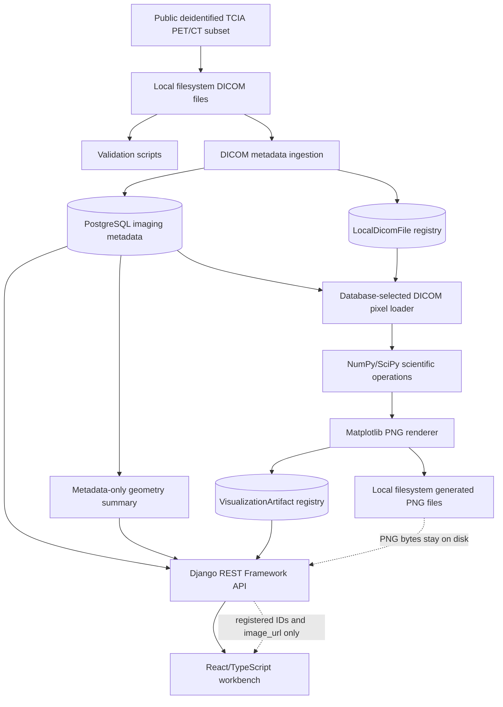

# Architecture

Quantitative Molecular Imaging Platform is a local research workflow for a
selected public deidentified TCIA PET/CT subset. The system demonstrates safe
metadata handling, PostgreSQL-backed registries, database-selected local pixel
processing, registered visualization artifacts, and a browser workbench for
reviewing generated scientific PNGs and metadata.

It is not clinical software. It is not designed for diagnosis, treatment
decisions, or production patient care.

## System Diagram

PostgreSQL stores metadata. It does not store raw DICOM files, PNG bytes, or
NumPy arrays. Local filesystem paths are used by server-side processing and
registry validation, but public API responses are shaped around artifact IDs,
metadata fields, and `image_url` values.

## Component Responsibilities

`apps.imaging` owns study, series, instance, and `LocalDicomFile` metadata. The
local DICOM file registry maps one ingested `ImagingInstance` to one
repository-relative local file path, checksum, file size, and availability flag.
Absolute paths and parent traversal are rejected by model validation.

`apps.ingestion` tracks ingestion jobs and event metadata. The ingestion scripts
read DICOM headers with `pydicom stop_before_pixels=True` and upsert the
PostgreSQL metadata needed by downstream operations.

`apps.analysis` owns analysis runs, measurement results, scientific operation
helpers, visualization rendering, artifact registration, and artifact API
views. The scientific operation layer explicitly loads pixel arrays only after
PostgreSQL selects the target series and instance through the local registry.

The Django REST Framework API exposes metadata, controlled artifact generation,
registered artifact metadata, and registered PNG responses. It does not expose
DICOM files, NumPy arrays, local paths, SQL explorer access, upload endpoints,
or arbitrary filesystem browsing.

The React/TypeScript workbench displays overview data, imaging metadata,
analysis result metadata, artifact filters, controlled generation controls,
registered PNGs, and artifact metadata. The browser submits scientific
parameters, not paths or image data.

## End-To-End Data Flow

1. A reviewer optionally downloads the selected public deidentified TCIA CT and
   PT series into local ignored data directories.
2. Local validation checks expected files and DICOM headers without reading
   pixel arrays.
3. Metadata ingestion creates or updates `ImagingStudy`, `ImagingSeries`,
   `ImagingInstance`, and `LocalDicomFile` records in PostgreSQL.
4. Metadata-only analysis can produce a geometry summary from stored rows,
   columns, spacing, counts, and related series metadata.
5. For visualization work, PostgreSQL selects the series and instance. The
   server resolves the related `LocalDicomFile` and explicitly loads the local
   DICOM pixel array.
6. The scientific operation layer applies DICOM rescaling and optionally runs
   Gaussian filtering or Sobel gradient magnitude through SciPy.
7. The visualization layer renders a PNG with Matplotlib. CT rescale and
   Gaussian displays can use window center and width; percentile controls are
   used for supported display scaling.
8. The artifact registry validates the repository-relative PNG path, checksum,
   file size, operation, modality, units, display range, and source instance,
   then registers the metadata in PostgreSQL.
9. The API returns registered artifact metadata and an `image_url`. It serves
   PNG bytes only through artifact database IDs.
10. The frontend refreshes the artifact collection, selects the generated
    artifact, displays the PNG, and renders registered scientific metadata.

## PostgreSQL Role

PostgreSQL is the authoritative registry for imaging metadata, ingestion
metadata, analysis metadata, local DICOM file records, and visualization
artifact metadata. It records enough provenance to select source DICOM files
and review generated artifacts, including UIDs, modality, operation, slice
index, value units, display range, checksum, and file size.

It intentionally does not store PNG bytes or NumPy arrays.

## Filesystem Role

Raw DICOM files remain local-only and ignored by Git. Generated visualization
PNGs are written as local files and are also ignored by Git. Server-side code
uses repository-relative registry paths to locate these files, while public API
responses avoid exposing those paths.

## Artifact Lifecycle

An artifact starts with a controlled request containing a series UID, operation,
and optional scientific display parameters. The backend validates the request,
selects source data through PostgreSQL, runs the scientific operation, renders a
PNG, validates and registers artifact metadata, and returns the registered
artifact representation.

Repeated generation of the same artifact path updates the existing
`VisualizationArtifact` row through the registry rather than creating duplicate
path records. The model keeps `relative_path` unique and continues to validate
that artifact paths remain repository-relative under `outputs/visualizations/`.

## API Safety Boundary

The public API boundary is intentionally narrow:

- Metadata endpoints are read-only.
- Artifact generation accepts controlled scientific parameters only.
- Clients cannot submit DICOM paths, PNG paths, output paths, image bytes, or
  NumPy arrays.
- Local filesystem paths are not returned in public responses.
- PNGs are served through registered artifact IDs.
- PT values are reported as `rescaled_pixel_value`, not SUV.

## Operation-Generation Flow

The implemented operation flow supports:

- `rescale`: DICOM rescale slope/intercept. CT units are `HU`; PT units are
  `rescaled_pixel_value`.
- `gaussian`: rescale followed by SciPy Gaussian smoothing with a positive
  sigma.
- `sobel`: rescale followed by Sobel gradient magnitude.

The output array is a private local process result. Matplotlib renders the
selected display to PNG, and only artifact metadata plus image access by
registered ID crosses the API boundary.

## Frontend Role

The frontend is a reviewer-facing scientific workbench, not a processing
engine. It validates the generation form, sends the selected parameters to the
backend, refreshes the artifact list after successful generation, selects the
returned artifact, and displays the PNG through the returned `image_url`.

It does not read local DICOM files, inspect local directories, upload files, run
SciPy, store browser-side scientific arrays, or infer clinical meaning.

## Non-Clinical Limitation

This repository is portfolio and research software. It has no clinical
validation, diagnostic-accuracy claims, authentication layer, production
deployment configuration, or machine-learning inference. Local raw DICOM data
and generated visualization files remain outside version control by design.
